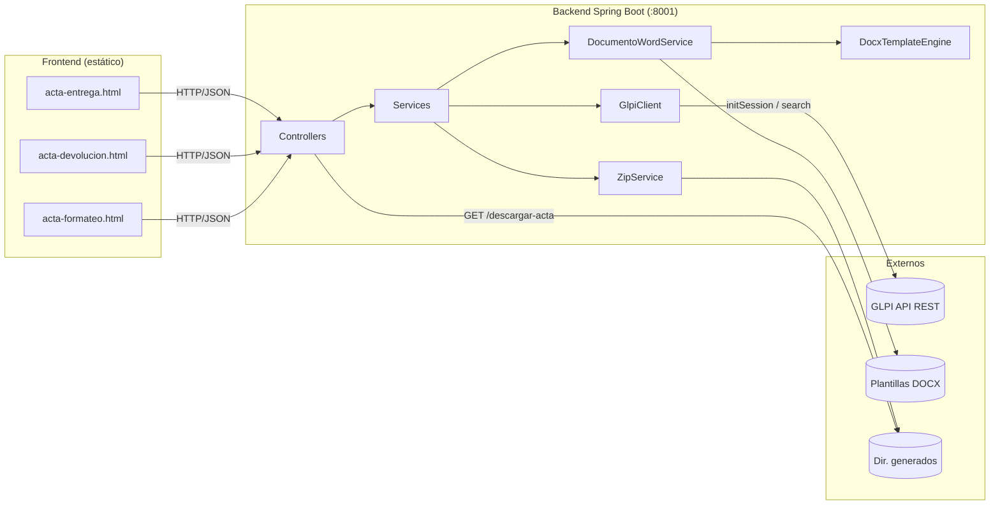
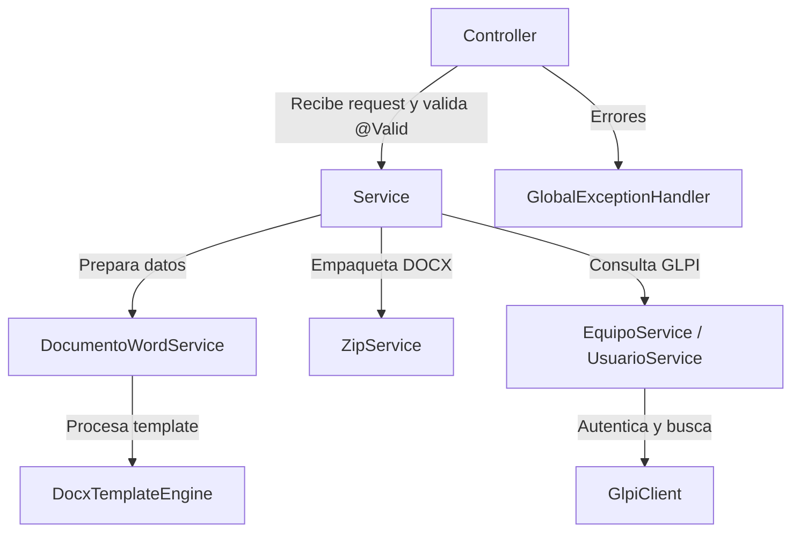
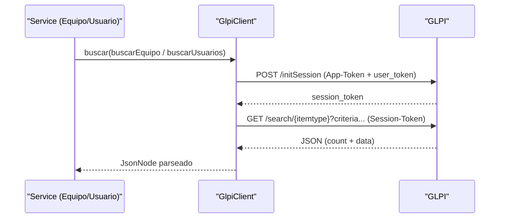
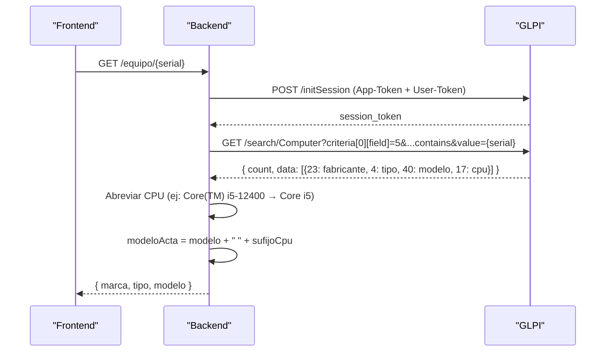
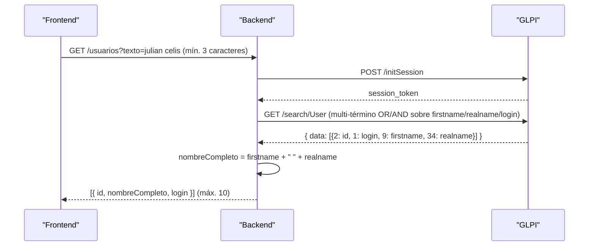
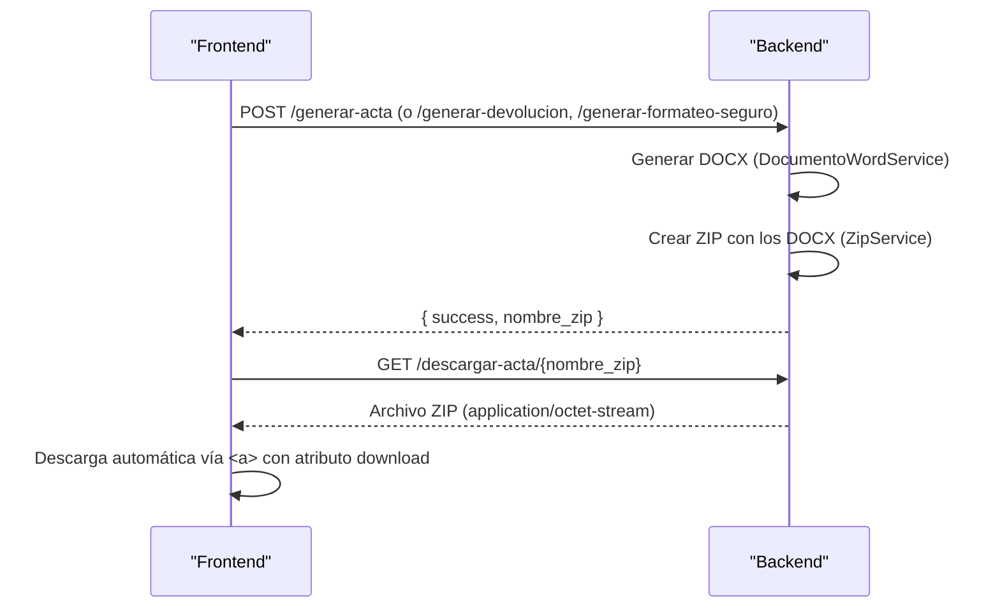

# Arquitectura del Sistema — Actas GLPI

## Visión general

Sistema cliente-servidor de dos capas. El frontend (web estática) se comunica por HTTP/JSON con el backend (API REST Spring Boot en `:8001`), que consulta GLPI para buscar equipos y usuarios, genera documentos DOCX desde plantillas Word y los empaqueta en ZIP para descarga.

Tres tipos de acta: **Entrega** (acta + checklist), **Devolución** (acta), **Formateo seguro** (acta).



---

## Backend

### Stack tecnológico

- **Java 21** + Spring Boot 3.4.1
- **Maven** (gestión de dependencias)
- **Apache POI 5.2.5** (manipulación de DOCX)
- **Jackson** (JSON), **Lombok**, **Jakarta Validation**
- **dotenv-java 3.2.0** (carga de `.env`)

### Paquetes del backend

```
com.empresa.actas/
├── ActasApplication.java          # Punto de entrada
├── config/
│   ├── AppConfig.java             # Carga .env (raíz), crea directorio de salida
│   └── CorsConfig.java            # CORS configurable (CORS_ALLOWED_ORIGINS)
├── controller/
│   ├── ActaController.java        # POST /generar-acta, GET /descargar-acta/{zip}
│   ├── DevolucionController.java  # POST /generar-devolucion
│   ├── FormateoSeguroController.java # POST /generar-formateo-seguro
│   ├── EquipoController.java      # GET /equipo/{serial}
│   └── UsuarioController.java     # GET /usuarios?texto=
├── dto/
│   ├── request/
│   │   ├── ActaRequest.java       # Entrada acta de entrega + checklist
│   │   ├── DevolucionRequest.java # Entrada acta de devolución
│   │   ├── FormateoSeguroRequest.java # Entrada acta de formateo seguro (máx. 4 equipos)
│   │   ├── EquipoItem.java        # Equipo (marca, tipo, modelo, serial, inventario, gb, estado)
│   │   ├── HardwareItem.java      # Hardware (tipo, descripcion, programa)
│   │   └── OtroElementoItem.java  # Otros elementos (solo tipo) — NO usado actualmente
│   └── response/
│       ├── ActaResponse.java      # success + nombre_zip + mensaje
│       ├── ErrorResponse.java     # success=false + mensaje
│       ├── EquipoResponse.java    # Equipo GLPI: marca, tipo, modelo
│       └── UsuarioResponse.java   # Usuario GLPI: id, nombreCompleto, login
├── exception/
│   └── GlobalExceptionHandler.java # Errores de validación (400) y generales (500) en JSON
└── service/
    ├── ActaService.java           # Orquesta: acta + checklist → ZIP
    ├── DevolucionService.java     # Orquesta: devolución → ZIP
    ├── FormateoSeguroService.java # Orquesta: formateo seguro → ZIP
    ├── DocumentoWordService.java  # Prepara datos y genera los DOCX
    ├── DocxTemplateEngine.java    # Reemplaza {{ vars }} en templates Word (a nivel de run)
    ├── EquipoService.java         # Consulta equipos en GLPI por serial
    ├── UsuarioService.java        # Consulta usuarios en GLPI (multi-término)
    ├── GlpiClient.java            # Cliente HTTP compartido (auth + search)
    └── ZipService.java            # Empaqueta DOCX en ZIP
```

### Capas y responsabilidades



- **Controller** — recibe HTTP, valida con `@Valid`, delega en el Service.
- **Service** — orquesta la generación: convierte DTO a Map, coordina Word y ZIP.
- **DocumentoWordService** — prepara datos (fecha indexada, items indexados, checkboxes, SO) y llama al motor.
- **DocxTemplateEngine** — motor de reemplazo de placeholders a nivel de run.
- **EquipoService / UsuarioService** — integran con GLPI vía `GlpiClient`.
- **GlpiClient** — centraliza autenticación (App-Token + User-Token → session_token) y el `HttpClient` con timeouts.
- **ZipService** — empaqueta los DOCX en un ZIP.

### Configuración y puertos

| Configuración | Valor |
|---------------|-------|
| Backend Spring Boot | `8001` |
| Frontend (Live Server VS Code) | `5501` |
| CORS | `app.cors.allowed-origins` (default: `127.0.0.1`, `localhost`, `:5500`, `:5501`, `:8080`, `localhost:8001`); se sobreescribe con `CORS_ALLOWED_ORIGINS` |

> **IMPORTANTE:** el frontend define la URL del backend en `frontend/js/config.js`. Se resuelve: `window.API_URL` (si existe) → `http://{hostname}:8001`. El backend debe seguir la misma regla de host para que el navegador no bloquee peticiones (ver sección CORS).

### Variables de entorno

Cargadas desde `.env` (raíz) por `AppConfig`, o desde variables del sistema (estas tienen prioridad):

| Variable | Obligatoria | Descripción |
|----------|-------------|-------------|
| `GLPI_URL` | No (fallback en yml) | URL base de la API REST de GLPI |
| `GLPI_APP_TOKEN` | **Sí** | App-Token de la aplicación GLPI |
| `GLPI_USER_TOKEN` | **Sí** | User-Token del usuario de la API |
| `CORS_ALLOWED_ORIGINS` | No (fallback en yml) | Orígenes CORS del despliegue |

Propiedades de `application.yml`:

```yaml
server:
  port: 8001

glpi:
  url: ${GLPI_URL:http://10.86.1.33/glpi/apirest.php}
  app-token: ${GLPI_APP_TOKEN}      # sin fallback → obligatorio
  user-token: ${GLPI_USER_TOKEN}    # sin fallback → obligatorio

app:
  generated-dir: ${java.io.tmpdir}/actas_glpi_generados
  templates-dir: classpath:plantillas
  cors:
    allowed-origins: ${CORS_ALLOWED_ORIGINS:http://127.0.0.1,http://localhost,http://127.0.0.1:5500,http://localhost:5500,http://127.0.0.1:5501,http://localhost:5501,http://127.0.0.1:8080,http://localhost:8001}
```

- `app.generated-dir`: directorio de DOCX/ZIP generados (en despliegue debe ser persistente).
- `app.templates-dir`: `classpath:plantillas` usa las plantillas dentro del JAR; soporta ruta absoluta para personalizarlas sin recompilar.

---

## Frontend

### Estructura

```
frontend/
├── css/
│   ├── styles.css          # Estilos custom (navbar, cards, autocomplete, toasts, grids)
│   ├── output.css          # CSS compilado (Tailwind + FlyonUI), versionado
│   └── app.css             # Fuente Tailwind/FlyonUI (se compila con npm run build:css)
├── js/
│   ├── config.js           # API_URL (se carga primero en los HTML)
│   ├── ui.js               # Utilidades compartidas (toast, validación, renumeración, búsqueda)
│   ├── autocomplete.js     # Autocompletado de usuarios GLPI (2 líneas: nombre + login)
│   ├── app.js              # Lógica acta de entrega
│   ├── devolucion.js       # Lógica acta de devolución
│   └── formateo.js         # Lógica acta de formateo seguro (máx. 4 equipos, campo GB)
├── pages/
│   ├── acta-entrega.html
│   ├── acta-devolucion.html
│   └── acta-formateo.html
├── img/logo.png
└── package.json            # Tailwind CSS + FlyonUI (build:css)
```

### Arquitectura de JavaScript

Cada página carga `config.js` y `ui.js` primero, y luego su lógica específica:

```
config.js → ui.js → autocomplete.js → app.js (entrega)
                                    → devolucion.js (devolución)
                                    → formateo.js (formateo)
```

- `config.js` — define `API_URL`. Debe cargarse antes que el resto de scripts.
- `ui.js` — `mostrarMensaje` (toast), `validarCampo`, `renumerarEquipos`, `buscarEquipoBloque`, `validarEquiposPorBloque` (compartidas).
- `autocomplete.js` — busca usuarios en GLPI (`GET /usuarios`) y autocompleta los campos de personas; muestra nombre completo y login.
- `app.js` / `devolucion.js` / `formateo.js` — validación, construcción del payload y descarga por página.

### Autocompletado de usuarios

Mínimo **3 caracteres** por campo. Estrategia backend multi-término (ver Integración GLPI).

| Página | Campos con autocompletado |
|--------|---------------------------|
| Acta de Entrega | `entregado_a`, `entregado_por` |
| Acta de Devolución | `entregado_por`, `recibido_por` |
| Acta de Formateo Seguro | `entregado_a`, `entregado_por` |

Cada sugerencia renderiza 2 líneas: `.autocomplete-nombre` (nombre completo) y `.autocomplete-login` (login; se crea solo si existe).

### Componentes UI

| Componente | Descripción |
|------------|-------------|
| Navbar | Navegación entre las 3 actas (la página actual resaltada) |
| Formulario de datos | Campos obligatorios del acta |
| Bloques dinámicos | Equipos y hardware/otros, agregados/eliminados dinámicamente |
| Checklist | 36 checkboxes en 6 secciones con acordeones (solo entrega) |
| Selector de SO | Radio buttons: Windows 10, Windows 11, Mac OS (solo entrega) |
| Autocompletado | Sugerencias de usuarios desde GLPI |
| Botón generar | Envía POST y descarga el ZIP |

---

## Integración con GLPI

### Autenticación



- `GlpiClient.iniciarSesion()` llama a `/initSession` con headers `App-Token` y `Authorization: user_token {token}` y lee `session_token` del cuerpo.
- `GlpiClient.search(itemtype, query)` usa `Session-Token`, valida que la respuesta sea 2xx (si no, lanza `RuntimeException`) y retorna el JSON parseado.
- Timeouts: **10 s** de conexión y **30 s** por request (evita requests colgadas si GLPI está lento o caído).

### Búsqueda de equipos



**Campos GLPI consultados (Computer):**

| Campo GLPI | Descripción | Uso en acta |
|------------|-------------|-------------|
| `5` | Serial (filtro, `contains`) | Búsqueda del equipo |
| `23` | Fabricante | Marca |
| `4` | Tipo de equipo | Tipo (Desktop, Laptop, ...) |
| `40` | Modelo | Modelo |
| `17` | Procesador | Sufijo del modelo (abreviado) |

La abreviatura del procesador (`cpuCorto`) usa patrones regex ordenados (`Ryzen\s+\d`, `Core Ultra`, `Core(TM) i\d`, `Core i\d`, `i\d`, `Pentium`, `Celeron`, `Xeon`). Si no hay muchos en GLPI o el equipo no existe, se devuelve vacío sin romper el flujo.

### Búsqueda de usuarios



**Estrategia multi-término** (`UsuarioService.buscarUsuarios`):

1. El texto se separa en términos por `\s+`.
2. Cada término busca `contains` en los campos `9` (firstname), `34` (realname) y `1` (login/name), encadenados con **OR** dentro del término.
3. Los grupos de términos se encadenan con **AND** (borde `(p+1) % 3 == 0`).
4. `forcedisplay[0]=2&forcedisplay[1]=1&forcedisplay[2]=9&forcedisplay[3]=34`, `range=0-9`.

Así, **"Julian Celis"** encuentra a un usuario con `firstname="Julian Alejandro"` y `realname="Celis Valderrama"` (GLPI `name="JuliCeli"`), aunque los términos no sean consecutivos ni estén en el mismo campo.

**Campos GLPI consultados (User):**

| Campo GLPI | Descripción | Uso |
|------------|-------------|-----|
| `2` | ID del usuario | Identificador (se solicita con `forcedisplay`) |
| `1` | name / login | Cuenta (segunda línea del autocompletado) |
| `9` | firstname | Nombres |
| `34` | realname | Apellidos |

---

## Generación de documentos Word

### Motor de templates (`DocxTemplateEngine`)

Reemplaza placeholders `{{ nombre_variable }}` dentro de DOCX. **Algoritmo:**

1. Copiar el template a la ruta de salida.
2. Abrir el DOCX con Apache POI.
3. Para cada párrafo (cuerpo + tablas):
   a. Concatenar el texto de todos los runs.
   b. Si contiene `{{`, buscar placeholders con regex `\{\{\s*(\w+)\s*\}\}`.
   c. Reconstruir run por run preservando el formato del run donde inicia el placeholder.
4. Guardar el documento.

**¿Por qué a nivel de run?** Word fragmenta el texto en "runs" cuando hay cambios de formato (negrita, color, tamaño). Un placeholder puede estar dividido en 3-4 runs; este enfoque preserva el formato original sin fusionar runs.

### Templates utilizados

| Template | Generado por | Contenido |
|----------|-------------|-----------|
| `Acta de Entrega 2 2 - copia.docx` | `generarActa()` | Acta de entrega con equipos y hardware |
| `ListaChequeo.docx` | `generarChecklist()` | 36 ítems de verificación + SO + primer equipo |
| `ActaDevolucion.docx` | `generarDevolucion()` | Acta de devolución con estados y otros elementos |
| `ActaFormateoSeguro.docx` | `generarFormateoSeguro()` | Acta de formateo seguro con capacidad y GB |

### Variables de templates

**Variables indexadas (el servicio rellena hasta el límite del template; lo no enviado queda vacío):**

| Acta | Prefijos | Máx. | Campos |
|------|----------|------|--------|
| Entrega | `eq_N_` | 10 | marca, tipo, modelo, serial, inventario |
| Entrega | `hw_N_` | 11 | tipo, descripcion, programa |
| Checklist | `chk_N_si` / `chk_N_no` | 36 | `"X"` o `""` según marcado |
| Checklist | `win10` / `win11` / `macos` | 1 | `"X"` si coincide el SO |
| Checklist | `responsable_verificacion` | 1 | Igual a `entregado_por` |
| Devolución | `eq_N_` | 10 | marca, tipo, modelo, serial, inventario, **estado** |
| Devolución | `ot_N_` | 10 | tipo |
| Formateo seguro | `eq_N_` | 4 | marca, tipo, modelo, serial, inventario, **gb** |
| Formateo seguro | `entrega_por` | 1 | Alias de `entregado_por` |

**Fecha (todas las actas):** `dia`, `mes`, `anio` (ej. `2026-08-27` → `27`, `08`, `2026`).

### Límites por tipo de acta

| Acta | Equipos (frontend) | Hardware / Otros (frontend) | Límite template (backend) |
|------|--------------------|-----------------------------|---------------------------|
| Entrega | 3 | 9 | 10 equipos, 11 hardware |
| Devolución | 3 | 3 (otros) | 10 equipos, 10 otros |
| Formateo seguro | **4** | — | 4 equipos |

---

## Proceso de descarga ZIP



El frontend crea dinámicamente un `<a>` con `href` (Blob URL) y `download`, hace clic y lo elimina del DOM.

---

## Validaciones

### Backend (Jakarta Validation)

`@Valid` en los controllers; errores capturados en `GlobalExceptionHandler`:

| DTO | Campo(s) | Regla |
|-----|----------|-------|
| `ActaRequest` | fecha, entregado_a, cargo_recibe, entregado_por, cargo_entrega, asunto, numero_sac, sistema_operativo | `@NotBlank` |
| `DevolucionRequest` | fecha | `@NotBlank` (resto validado en frontend) |
| `FormateoSeguroRequest` | fecha, entregado_a, cargo_recibe, entregado_por, cargo_entrega, asunto | `@NotBlank` |
| `FormateoSeguroRequest` | equipos | `@Size(max = 4)` |

Manejo de excepciones → 400/500 con `ErrorResponse { success:false, mensaje }`. Las excepciones no controladas se loguean en el servidor y devuelven `"Error interno del servidor"` al cliente (sin filtrar internals).

### Frontend (JavaScript)

| Validación | Ámbito | Comportamiento |
|------------|--------|----------------|
| Campos obligatorios | 3 formularios | `is-invalid` + scroll al primer error + foco |
| Equipos (serial, inventario) | 3 formularios | Obligatorio por equipo |
| GB | Formateo seguro | Obligatorio por equipo |
| Estado del equipo | Devolución | Obligatorio por equipo |
| Mín. 1 equipo | 3 formularios | No se puede eliminar el último |
| Máx. equipos | 3 (entrega/devolución) / 4 (formateo) | Mensaje de límite |
| Máx. hardware | 9 (entrega) / 3 (devolución) | Mensaje de límite |
| Sistema operativo | Entrega | `radio-so-error` |

---

## CORS

`CorsConfig` provee un `WebMvcConfigurer` sobre `/**`:

- `allowedOrigins(allowedOrigins.split(","))` — origen desde `app.cors.allowed-origins` (env `CORS_ALLOWED_ORIGINS`, fallback local).
- `allowedMethods("*")`, `allowedHeaders("*")`.
- `exposedHeaders("Content-Disposition")` — necesario para la descarga de archivos.

En despliegue, definir `CORS_ALLOWED_ORIGINS` con el host real del frontend (ej. `http://servidor-interno` o el dominio). Son permitidos por defecto en desarrollo:

- `http://127.0.0.1`, `http://localhost` (puerto 80)
- `http://127.0.0.1:5500`, `http://localhost:5500` (Live Server)
- `http://127.0.0.1:5501`, `http://localhost:5501` (Live Server, puerto del proyecto)
- `http://127.0.0.1:8080` (servidor alternativo)
- `http://localhost:8001` (backend mismo host)

---

## Despliegue Docker (estado actual)

- **No existen `Dockerfile` ni `docker-compose.yml`** en el repositorio. `docker.md` contiene la propuesta (backend `eclipse-temurin:21-jre`, frontend `nginx:alpine`, compose con `env_file: .env`, puertos `8001`/`80`); está sin seguimiento en git.
- Para el primer despliegue interno: volumen persistente para `app.generated-dir`, `CORS_ALLOWED_ORIGINS` con el host del frontend, tokens GLPI como variables del contenedor.