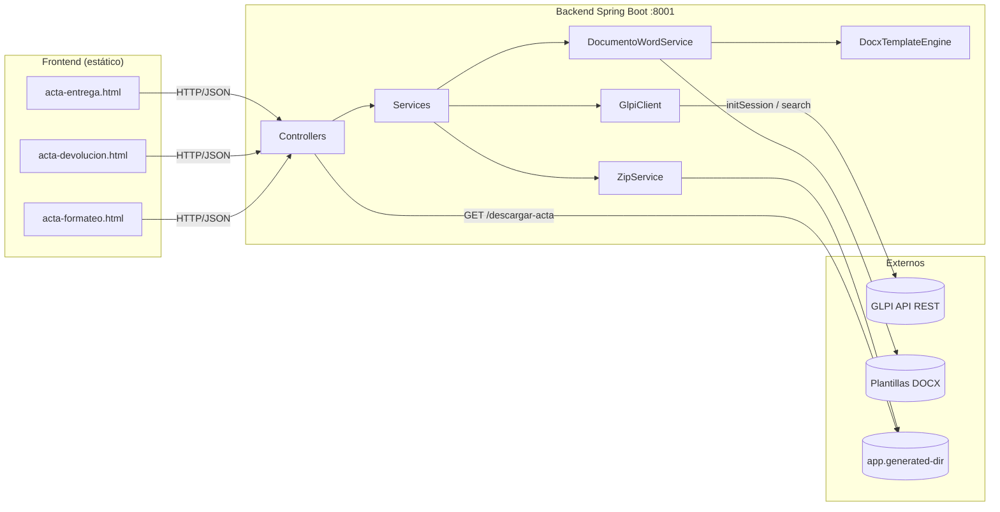
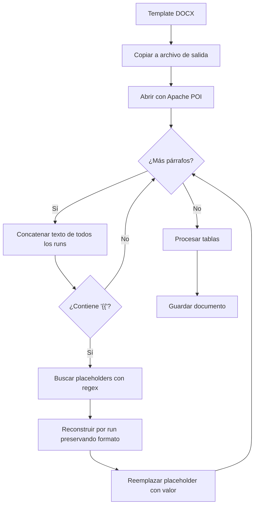

# Documentación Técnica — Actas GLPI

Documento técnico de referencia del sistema de generación de actas Word (DOCX) integrado con GLPI. **El código fuente es la única fuente de verdad**; este documento describe exactamente el comportamiento actual del repositorio (rama `main`).

Relacionados: [README.md](README.md) (inicio rápido), [ARQUITECTURA.md](ARQUITECTURA.md) (visión de capas), [FLUJO_FUNCIONAL.md](FLUJO_FUNCIONAL.md) (flujos de negocio), [docs/MANUAL_USUARIO.md](docs/MANUAL_USUARIO.md) (uso), [docs/GUIA_DESARROLLADOR.md](docs/GUIA_DESARROLLADOR.md) (onboarding), [docs/MANTENIMIENTO.md](docs/MANTENIMIENTO.md) (mantenimiento).

---

## 1. Visión general

Sistema cliente-servidor de dos capas:

- **Frontend** — aplicación web estática (HTML/CSS/JS vanilla, Tailwind CSS 4, FlyonUI 2). Captura datos de actas, consulta GLPI para autocompletar equipos y usuarios, y descarga el ZIP generado.
- **Backend** — API REST en Java 21 / Spring Boot 3.4.1. Valida la entrada, consulta GLPI (equipos y usuarios), genera DOCX desde plantillas Word mediante Apache POI, los empaqueta en ZIP y los sirve para descarga.

Tres tipos de acta:

| Tipo | Endpoint | ZIP | DOCX en el ZIP |
|------|----------|-----|----------------|
| Entrega | `POST /generar-acta` | `ActaLista_{serial}_{asunto}.zip` | Acta de entrega + Lista de chequeo |
| Devolución | `POST /generar-devolucion` | `Devolucion_{serial}_{motivo}.zip` | Acta de devolución |
| Formateo seguro | `POST /generar-formateo-seguro` | `FormateoSeguro_{serial}_{asunto}.zip` | Acta de formateo seguro |

---

## 2. Stack tecnológico

**Backend**
- Java 21, Spring Boot 3.4.1, Maven.
- Apache POI 5.2.5 (`poi-ooxml`) — lectura/escritura DOCX.
- Jackson (JSON), Lombok, Jakarta Validation (`jakarta.validation`).
- dotenv-java 3.2.0 — carga de `.env`.
- Spring Boot DevTools (runtime, opcional).
- Sin Spring Security; sin tests automatizados (`backend/src/test` vacío).

**Frontend**
- HTML5, CSS3, JavaScript vanilla (sin framework).
- Tailwind CSS 4.3.3 (compila a `frontend/css/output.css`, versionado).
- FlyonUI 2.4.1 (componentes; `flyonui.js` se carga desde `node_modules`, requiere `npm install`).
- Flatpickr (selector de fechas, carga por CDN en las páginas).

---

## 3. Arquitectura y flujo de solicitud



**Flujo de una generación** (cualquiera de las 3 actas):

1. El frontend valida los campos y envía `POST` con un JSON.
2. El controller recibe el DTO y valida con `@Valid` (Jakarta Validation).
3. El service orquestador convierte el DTO a `Map<String,Object>` (Jackson) y delega en `DocumentoWordService`.
4. `DocumentoWordService` prepara los datos (fecha descompuesta, items indexados `eq_N_*`, `hw_N_*`, `ot_N_*`, checkboxes) y llama a `DocxTemplateEngine`.
5. `DocxTemplateEngine` copia la plantilla, reemplaza placeholders `{{ var }}` a nivel de run y escribe el DOCX en `app.generated-dir`.
6. `ZipService` empaqueta los DOCX en un ZIP; el service retorna `{ success, nombre_zip }`.
7. El frontend hace `GET /descargar-acta/{nombreZip}` y descarga el archivo.

---

## 4. Estructura del proyecto

```
actas-glpi/
├── backend/                         # API REST (Java 21, Spring Boot 3.4.1)
│   ├── pom.xml
│   └── src/main/
│       ├── java/com/empresa/actas/
│       │   ├── ActasApplication.java          # Punto de entrada
│       │   ├── config/
│       │   │   ├── AppConfig.java             # Carga .env, crea generated-dir
│       │   │   └── CorsConfig.java            # CORS configurable por entorno
│       │   ├── controller/                    # Acta, Devolucion, FormateoSeguro, Equipo, Usuario
│       │   ├── dto/
│       │   │   ├── request/                   # ActaRequest, DevolucionRequest, FormateoSeguroRequest,
│       │   │   │                              # EquipoItem, HardwareItem, OtroElementoItem
│       │   │   └── response/                  # ActaResponse, ErrorResponse, EquipoResponse, UsuarioResponse
│       │   ├── exception/
│       │   │   └── GlobalExceptionHandler.java
│       │   └── service/
│       │       ├── ActaService.java           # Orquesta entrega + checklist → ZIP
│       │       ├── DevolucionService.java     # Orquesta devolución → ZIP
│       │       ├── FormateoSeguroService.java # Orquesta formateo seguro → ZIP
│       │       ├── DocumentoWordService.java  # Prepara datos y llama al motor
│       │       ├── DocxTemplateEngine.java    # Motor de reemplazo {{ var }} en DOCX
│       │       ├── EquipoService.java         # Búsqueda equipos GLPI por serial
│       │       ├── UsuarioService.java        # Búsqueda usuarios GLPI multi-término
│       │       ├── GlpiClient.java            # Cliente HTTP compartido (auth + search)
│       │       └── ZipService.java            # Empaqueta DOCX en ZIP
│       └── resources/
│           ├── application.yml
│           └── plantillas/                    # Templates DOCX (4 archivos)
├── frontend/
│   ├── css/                     # styles.css (custom), output.css (compilado), app.css (fuente)
│   ├── js/                      # config.js, ui.js, autocomplete.js, app.js, devolucion.js, formateo.js
│   ├── pages/                   # acta-entrega.html, acta-devolucion.html, acta-formateo.html
│   ├── img/logo.png
│   └── package.json             # Tailwind + FlyonUI (@tailwindcss/cli, build:css)
├── docs/
│   ├── MANUAL_USUARIO.md
│   ├── MANTENIMIENTO.md
│   └── GUIA_DESARROLLADOR.md
├── .env.example                 # Plantilla de variables de entorno
├── .gitignore                   # excluye .env, node_modules/, backend/target/
├── docker.md                    # Notas de despliegue Docker (propuesta, sin Dockerfile)
├── README.md
├── ARQUITECTURA.md
├── FLUJO_FUNCIONAL.md
└── DOCUMENTACION_TECNICA.md     # Este documento
```

---

## 5. Configuración

### 5.1 `application.yml`

| Propiedad | Valor por defecto | Descripción |
|-----------|-------------------|-------------|
| `server.port` | `8001` | Puerto del backend. Debe coincidir con `API_URL` del frontend. |
| `glpi.url` | `${GLPI_URL:http://10.86.1.33/glpi/apirest.php}` | URL base de la API REST de GLPI. |
| `glpi.app-token` | `${GLPI_APP_TOKEN}` (sin fallback) | App-Token GLPI. **Obligatorio para arrancar.** |
| `glpi.user-token` | `${GLPI_USER_TOKEN}` (sin fallback) | User-Token GLPI. **Obligatorio para arrancar.** |
| `app.generated-dir` | `${java.io.tmpdir}/actas_glpi_generados` | Directorio de salida de DOCX y ZIP. |
| `app.templates-dir` | `classpath:plantillas` | Origen de las plantillas DOCX. |
| `app.cors.allowed-origins` | `http://127.0.0.1,http://localhost,http://127.0.0.1:5500,http://localhost:5500,http://127.0.0.1:5501,http://localhost:5501,http://127.0.0.1:8080,http://localhost:8001` | Orígenes CORS permitidos (separados por coma). |

### 5.2 Variables de entorno

`AppConfig` (clase `@Configuration`) en `@PostConstruct`:

1. Carga `.env` desde la raíz del proyecto con `Dotenv.configure().directory("../").filename(".env")` (ruta relativa al directorio de trabajo; si el backend se ejecuta desde `backend/`, resuelve a la raíz).
2. Establece como **System properties** `GLPI_URL`, `GLPI_APP_TOKEN`, `GLPI_USER_TOKEN` **solo si la variable no existe en el entorno real** (`System.getenv`). Las variables del sistema (Docker, servicio, CI) tienen prioridad sobre `.env`.
3. Si el `.env` no carga, lo registra por consola y continúa (`catch` silencioso).

| Variable | Obligatoria | Fallback | Uso |
|----------|-------------|----------|-----|
| `GLPI_URL` | No | `http://10.86.1.33/glpi/apirest.php` (en yml) | URL base de la API de GLPI |
| `GLPI_APP_TOKEN` | **Sí** | Ninguno | App-Token |
| `GLPI_USER_TOKEN` | **Sí** | Ninguno | User-Token |
| `CORS_ALLOWED_ORIGINS` | No | lista local (ver yml) | Orígenes CORS para el despliegue |

> Si `GLPI_APP_TOKEN` o `GLPI_USER_TOKEN` no están definidos, Spring no resuelve `glpi.app-token`/`glpi.user-token` y la aplicación **no arranca** (falla al resolver el placeholder).

### 5.3 CORS

`CorsConfig` provee un `WebMvcConfigurer` que aplica a `/**`:

- `allowedOrigins(allowedOrigins.split(","))` — desde `app.cors.allowed-origins`.
- `allowedMethods("*")`, `allowedHeaders("*")`.
- `exposedHeaders("Content-Disposition")` — necesario para que el frontend lea el nombre del archivo en la descarga.

En producción/Docker se sobreescribe con `CORS_ALLOWED_ORIGINS`, p. ej. `http://servidor-actas` o el dominio del frontend.

---

## 6. Especificación de endpoints

| Método | Ruta | Body | Respuesta |
|--------|------|------|-----------|
| `POST` | `/generar-acta` | `ActaRequest` | `ActaResponse` (200) o `ErrorResponse` (400) |
| `POST` | `/generar-devolucion` | `DevolucionRequest` | `ActaResponse` (200) o `ErrorResponse` (400) |
| `POST` | `/generar-formateo-seguro` | `FormateoSeguroRequest` | `ActaResponse` (200) o `ErrorResponse` (400) |
| `GET` | `/descargar-acta/{nombreZip}` | — | ZIP (octet-stream) o `ErrorResponse` |
| `GET` | `/equipo/{serial}` | — | `EquipoResponse` |
| `GET` | `/usuarios?texto=` | — | `Array<UsuarioResponse>` |

### 6.1 `POST /generar-acta`

Genera 2 DOCX (acta de entrega + lista de chequeo) y los empaqueta en ZIP.

**Ejemplo de request**
```json
{
  "fecha": "2026-08-27",
  "entregado_a": "Julian Alejandro Celis",
  "cargo_recibe": "Analista TI",
  "entregado_por": "Laura Rojas",
  "cargo_entrega": "Administrador",
  "asunto": "Entrega computador",
  "numero_sac": "SAC-2026-001",
  "sistema_operativo": "Windows 11",
  "observaciones": "Entrega a nuevo colaborador",
  "equipos": [
    {
      "marca": "Dell",
      "tipo": "Laptop",
      "modelo": "Latitude 5440 Core i5",
      "serial": "ABC123XYZ",
      "inventario": "INV-0001"
    }
  ],
  "hardware": [
    { "tipo": "Monitor", "descripcion": "24 pulgadas", "programa": "" },
    { "tipo": "Office", "descripcion": "", "programa": "Microsoft 365" }
  ],
  "checklist": {
    "chk_1": true,
    "chk_2": false
  }
}
```

**Ejemplo de respuesta**
```json
{
  "success": true,
  "nombre_zip": "ActaLista_ABC123XYZ_EntregaComputador.zip",
  "mensaje": "Documentación generada correctamente"
}
```

Nombre del ZIP: `ActaLista_{serial del 1er equipo}_{asunto limpio}.zip`; si no hay equipos, serial = `SinSerial`. El asunto se limpia con `replaceAll("[^a-zA-Z0-9]", "")`.

### 6.2 `POST /generar-devolucion`

Genera 1 DOCX (acta de devolución). Solo `fecha` se valida con `@NotBlank` en el backend; el resto se valida en el frontend.

```json
{
  "fecha": "2026-08-27",
  "entregado_por": "Laura Rojas",
  "cedula": "1020...",
  "cargo_entrega": "Administrador",
  "recibido_por": "Julian Celis",
  "cargo_recibe": "Analista TI",
  "area_recibe": "Tecnología",
  "motivo": "Cambio de equipo",
  "observaciones": "",
  "equipos": [
    { "marca": "HP", "tipo": "Desktop", "modelo": "EliteDesk", "serial": "Z99", "inventario": "INV-0002", "estado": "Bueno" }
  ],
  "hardware": [
    { "tipo": "Teclado" }
  ]
}
```

Nombre del ZIP: `Devolucion_{serial}_{motivo limpio}.zip`.

### 6.3 `POST /generar-formateo-seguro`

Genera 1 DOCX (acta de formateo seguro). Campos `@NotBlank`: `fecha`, `entregado_a`, `cargo_recibe`, `entregado_por`, `cargo_entrega`, `asunto`. Lista `equipos` con `@Size(max = 4)` (capacidad de la plantilla). Cada equipo incluye el campo **`gb`** (cantidad en gigas).

```json
{
  "fecha": "2026-08-27",
  "entregado_a": "Julian Celis",
  "cargo_recibe": "Analista TI",
  "entregado_por": "Laura Rojas",
  "cargo_entrega": "Administrador",
  "asunto": "Formateo seguro",
  "equipos": [
    { "serial": "ABC123XYZ", "marca": "Dell", "tipo": "Laptop", "modelo": "Latitude 5440", "inventario": "INV-0001", "gb": "512" }
  ]
}
```

Nombre del ZIP: `FormateoSeguro_{serial}_{asunto limpio}.zip`.

### 6.4 `GET /descargar-acta/{nombreZip}`

Sirve el ZIP desde `app.generated-dir` con `Content-Type: application/octet-stream` y `Content-Disposition: attachment; filename="{nombreZip}"`.

**Seguridad (path traversal):**
1. `esNombreZipInvalido()` rechaza `null`, vacío, `..`, `/` o `\` → `400 { success:false, mensaje:"Nombre de archivo inválido" }`.
2. Normalización: `dir = Paths.get(generatedDir).toAbsolutePath().normalize()`; `rutaZip = dir.resolve(nombreZip).normalize()`. Si `!rutaZip.startsWith(dir)` o el archivo no existe → `200 { success:false, mensaje:"Archivo no encontrado" }` (el frontend espera 200 en este caso; comportamiento actual intencional).

### 6.5 `GET /equipo/{serial}`

Consulta GLPI. Respuesta `EquipoResponse { marca, tipo, modelo }`. Ver [Integración GLPI](#8-integración-con-glpi).

### 6.6 `GET /usuarios?texto={texto}`

Busca usuarios en GLPI (mínimo 3 caracteres; si el texto es menor devuelve `[]`). Respuesta `Array<UsuarioResponse { id, nombreCompleto, login }>`, máximo 10 resultados. Ver [Integración GLPI](#8-integración-con-glpi).

---

## 7. DTOs

### 7.1 Request

| DTO | Campos | Validación |
|-----|--------|------------|
| `ActaRequest` | `fecha`, `entregado_a`, `cargo_recibe`, `entregado_por`, `cargo_entrega`, `asunto`, `numero_sac`, `sistema_operativo`, `observaciones`(opcional), `equipos: List<EquipoItem>`, `hardware: List<HardwareItem>`, `checklist: Map<String,Boolean>` | 8 campos `@NotBlank` |
| `DevolucionRequest` | `fecha`, `entregado_por`, `cedula`, `cargo_entrega`, `recibido_por`, `cargo_recibe`, `area_recibe`, `motivo`, `observaciones`(opcional), `equipos`, `hardware` | solo `fecha` `@NotBlank` (resto validado en frontend) |
| `FormateoSeguroRequest` | `fecha`, `entregado_a`, `cargo_recibe`, `entregado_por`, `cargo_entrega`, `asunto`, `equipos: List<EquipoItem>` | 6 campos `@NotBlank`; `equipos` `@Size(max=4)` |
| `EquipoItem` | `marca`, `tipo`, `modelo`, `serial`, `inventario`, `gb`(solo formateo), `estado`(solo devolución) | — |
| `HardwareItem` | `tipo`, `descripcion`, `programa` | — |
| `OtroElementoItem` | `tipo` | — |

> `OtroElementoItem` existe en el paquete pero **no se usa** en el flujo actual: tanto devolución como formateo reciben `hardware: List<HardwareItem>` y `FormateoSeguroRequest` recibe `equipos`. (Hallazgo de mantenibilidad, se documenta tal cual.)

### 7.2 Response

| DTO | Campos | Uso |
|-----|--------|-----|
| `ActaResponse` | `success: boolean`, `nombre_zip` (JSON, campo Java `nombreZip` con `@JsonProperty("nombre_zip")`), `mensaje` | Éxito/error de generación; `ok(nombreZip)` y `error(mensaje)` estáticos |
| `ErrorResponse` | `success: boolean` (false), `mensaje` | Errores HTTP (400/500) |
| `EquipoResponse` | `marca`, `tipo`, `modelo` | Equipo GLPI |
| `UsuarioResponse` | `id`, `nombreCompleto`, `login` | Usuario GLPI para autocompletado |

---

## 8. Integración con GLPI

### 8.1 Cliente HTTP compartido (`GlpiClient`)

`@Component` que centraliza autenticación y el `HttpClient`:

- `HttpClient` con `connectTimeout = 10s`.
- `CONNECT_TIMEOUT = Duration.ofSeconds(10)`; `REQUEST_TIMEOUT = Duration.ofSeconds(30)` aplicado a **cada** request con `.timeout(REQUEST_TIMEOUT)`.

**`iniciarSesion()`**
```
GET {glpi.url}/initSession
Headers:
  App-Token: {appToken}
  Authorization: user_token {userToken}
→ body JSON: { "session_token": "..." }
```

**`search(itemtype, query)`**
```
GET {glpi.url}/search/{itemtype}{query}
Headers:
  App-Token: {appToken}
  Session-Token: {sessionToken}
→ si status no está en [200,300) lanza RuntimeException("GLPI respondió HTTP {status}")
→ retorna el JSON raíz parseado (contiene "count" y "data")
```

Cada llamada genera una sesión nueva (`search` inicia sesión internamente). No hay caché de `session_token`.

### 8.2 Búsqueda de equipos (`EquipoService`)

`GET /equipo/{serial}` → `buscarEquipo(serial)`:

1. Construye la query (campo 5, `contains`, sensibilidad del serial en minúsculas/llaves de GLPI):
```
?criteria[0][field]=5&criteria[0][searchtype]=contains&criteria[0][value]={serial}
 &forcedisplay[0]=23&forcedisplay[1]=4&forcedisplay[2]=40&forcedisplay[3]=17
```
2. Toma el primer resultado de `data`.
3. Extrae campos; `getFieldValue` maneja arrays (concatena con espacio).
4. Abrevia el procesador con `cpuCorto` y compone el modelo del acta:

| GLPI campo 17 | `cpuCorto` | modeloActa |
|---------------|------------|------------|
| `Intel(R) Core(TM) i5-12400` | `Core i5` | `{modelo} Core i5` |
| `AMD Ryzen 5 5600X` | `Ryzen 5` | `{modelo} Ryzen 5` |
| `12th Gen Intel(R) Core(TM) i7-12700K` | `Core i7` | `{modelo} Core i7` |
| `Intel(R) Xeon E5-2620` | `Xeon` | `{modelo} Xeon` |

5. Devuelve `EquipoResponse(marca, tipo, modeloActa)`.

**Comportamiento ante error:** si GLPI no responde, no autentica o no encuentra el equipo, `buscarEquipo` captura **todas** las excepciones y devuelve `EquipoResponse("", "", "")` **sin registrar log**. (Hallazgo: sin log, un fallo de GLPI es invisible en los logs del servidor; ver [Partes a atender](#15-partes-a-atender-a-futuro).)

### 8.3 Búsqueda de usuarios (`UsuarioService`)

`GET /usuarios?texto=` → `buscarUsuarios(texto)`:

1. **Umbral:** si el texto (trim) tiene menos de 3 caracteres → `[]`.
2. **Tokens:** separa por `\s+` (uno o más espacios). `total = tokens.length * 3`.
3. **Query multi-término:** por cada término `t` se generan 3 criterios sobre los campos de búsqueda, en orden `9` (firstname), `34` (realname), `1` (login/name):
   - Dentro del grupo del término: `link=OR` (el término puede estar en cualquiera de los 3 campos).
   - Entre grupos de términos: `link=AND` en el borde `(p+1) % 3 == 0`.
   - Con esto, búsqueda de N términos exige que **cada** término aparezca en (firstname OR realname OR login), sin importar posición ni consecutividad.
4. Cierra con `forcedisplay[0]=2&forcedisplay[1]=1&forcedisplay[2]=9&forcedisplay[3]=34&range=0-9`.

**Query real para `Julian Celis`** (2 términos):
```
criteria[0][field]=9&criteria[0][searchtype]=contains&criteria[0][value]=Julian&criteria[0][link]=OR&
criteria[1][field]=34&criteria[1][searchtype]=contains&criteria[1][value]=Julian&criteria[1][link]=OR&
criteria[2][field]=1&criteria[2][searchtype]=contains&criteria[2][value]=Julian&criteria[2][link]=AND&
criteria[3][field]=9&criteria[3][searchtype]=contains&criteria[3][value]=Celis&criteria[3][link]=OR&
criteria[4][field]=34&criteria[4][searchtype]=contains&criteria[4][value]=Celis&criteria[4][link]=OR&
criteria[5][field]=1&criteria[5][searchtype]=contains&criteria[5][value]=Celis&
forcedisplay[0]=2&forcedisplay[1]=1&forcedisplay[2]=9&forcedisplay[3]=34&range=0-9
```

El `value` se codifica con `URLEncoder.encode(..., UTF_8)`.

5. Extrae `id` (columna `2` o nodo `id`) y agrega el usuario si `id > 0` y tiene nombre o login; arma `nombreCompleto = (firstname + " " + realname).trim()` y `login = campo 1`.
6. Retorna máximo 10 (`range=0-9`).

**Campos GLPI de `User` usados:**

| Campo GLPI | Descripción | Uso |
|------------|-------------|-----|
| `2` | id | Identificador (se solicita con `forcedisplay`; GLPI no lo incluye por defecto) |
| `1` | name / login | Cuenta del usuario (se muestra como segunda línea en el autocompletado) |
| `9` | firstname | Parte del nombre completo |
| `34` | realname | Parte del nombre completo |

**Comportamiento ante error:** en `catch` devuelve `resultados` vacíos **sin log** (mismo hallazgo que EquipoService).

### 8.4 Timeouts

- Conectar: 10 s.
- Request (cada llamada `initSession`/`search`): 30 s.

Evita que un GLPI lento/indisponible deje requests colgadas.

---

## 9. Generación de documentos Word

### 9.1 `DocxTemplateEngine` (motor de plantillas)

Clase estática (`processTemplate(templatePath, vars, outputPath)`), reemplaza placeholders `{{ nombre_variable }}` en DOCX **a nivel de run**:

1. Copia el template a la ruta de salida y lo abre con Apache POI (`XWPFDocument`).
2. Itera párrafos del **cuerpo** y de las **tablas**.
3. Concatena el texto de todos los runs de cada párrafo; si contiene `{{`, busca los placeholders con regex `\{\{\s*(\w+)\s*\}\}`.
4. Reconstruye el párrafo run por run (con un arreglo de límites por run), reemplazando cada placeholder por su valor del mapa `vars` y preservando el formato del run donde empieza.
5. Guarda y cierra el documento.

**Por qué a nivel de run:** Word divide el texto en "runs" cuando cambia el formato (negrita, color, tamaño). Un placeholder puede quedar partido en varios runs; reemplazar el texto concatenado destruiría el formato. Este motor detecta dónde inicia cada placeholder y escribe su valor ahí, manteniendo el formato.



### 9.2 `DocumentoWordService` (preparación de datos)

Cada método de generación hace: `prepararFecha` → indexación de items (`eq_N_*`, `hw_N_*`, `ot_N_*`) → conversión a `Map<String,String>` → `resolveTemplate` → procesamiento.

**`resolveTemplate`:** si `app.templates-dir` empieza con `classpath:`, copia el recurso a un directorio temporal (`Files.createTempDirectory("actas-tpl-")`) y retorna esa ruta; si es ruta absoluta, la resuelve directamente. **Motivo:** Apache POI necesita una ruta real de archivo, no un recurso de classpath empaquetado en el JAR.

**`prepararFecha`:** parsea `fecha` (formato `yyyy-MM-dd`) y agrega `dia`/`mes`/`anio` (ej. `2026-08-27` → `dia=27`, `mes=08`, `anio=2026`). Si no parsea, deja las tres claves vacías.

**Datos indexados (el servicio rellena TODOS los slots hasta el límite del template; lo que el frontend no envíe queda `""`):**

| Método | Template | Prefiijos indexados |
|--------|----------|---------------------|
| `generarActa` | `Acta de Entrega 2 2 - copia.docx` | `hw_1..11` (tipo/descripcion/programa), `eq_1..10` (marca/tipo/modelo/serial/inventario) |
| `generarChecklist` | `ListaChequeo.docx` | `responsable_verificacion`, `win10/win11/macos`, `chk_1..36_si`/`chk_1..36_no`, `eq_1_*` (solo el primer equipo) |
| `generarDevolucion` | `ActaDevolucion.docx` | `eq_1..10` (+ `_estado`), `ot_1..10` (tipo) |
| `generarFormateoSeguro` | `ActaFormateoSeguro.docx` | `entrega_por` (alias de `entregado_por`), `eq_1..4` (+ `_gb`) |

**Mal funcionamiento si placeholders sin relleno:** cualquier `{{ var }}` que no exista en `vars` queda como texto literal en el DOCX (ver [Mantenimiento](docs/MANTENIMIENTO.md)).

### 9.3 Ejemplo concreto de lugarholders → valores

Para una entrega con 1 equipo y 2 hardware:

```text
dia=27  mes=08  anio=2026
entregado_a=Julian Alejandro Celis   entregado_por=Laura Rojas
eq_1_marca=Dell   eq_1_tipo=Laptop   eq_1_modelo=Latitude 5440 Core i5
eq_1_serial=ABC123XYZ   eq_1_inventario=INV-0001
hw_1_tipo=Monitor  hw_1_descripcion=24 pulgadas
hw_2_tipo=Office  hw_2_programa=Microsoft 365
chk_1_si=X  chk_1_no=   (checklist[chk_1]=true)
chk_2_si=   chk_2_no=X  (checklist[chk_2]=false)
win10=   win11=X   macos=   (sistema_operativo="Windows 11")
responsable_verificacion=Laura Rojas   (checklist: = entregado_por)
```

---

## 10. Empaquetado y descarga ZIP

### 10.1 `ZipService`

`crearZip(Path rutaZip, Path... archivos)` escribe un ZIP con `ZipOutputStream`: por cada `Path` recibe un `ZipEntry` (nombre = nombre del archivo) y copia su contenido (`Files.copy`). Acepta 1 o 2 DOCX. Lo usan `ActaService` (acta + checklist), `DevolucionService` (1) y `FormateoSeguroService` (1).

### 10.2 Nombres de ZIP y DOCX

| Acta | DOCX generados | ZIP |
|------|----------------|-----|
| Entrega | `ActaEntrega_{serial}_{asunto}.docx`, `Checklist_{serial}_{asunto}.docx` | `ActaLista_{serial}_{asunto}.zip` |
| Devolución | `Devolucion_{serial}_{motivo}.docx` | `Devolucion_{serial}_{motivo}.zip` |
| Formateo seguro | `FormateoSeguro_{serial}_{asunto}.docx` | `FormateoSeguro_{serial}_{asunto}.zip` |

- `serial` = serial del **primer** equipo; si no hay equipos → `SinSerial`.
- `asunto`/`motivo` = texto del campo con `replaceAll("[^a-zA-Z0-9]", "")`.
- Todos los archivos se escriben en `app.generated-dir` (el service crea el directorio con `Files.createDirectories` antes de escribir).

### 10.3 Descarga

El frontend recibe `nombre_zip` y hace:

1. `GET {API_URL}/descargar-acta/{nombre_zip}`.
2. Convierte la respuesta a `Blob`, crea `URL.createObjectURL`.
3. Crea un `<a>` con `href` y `download = nombre_zip`, hace clic y lo elimina; revoca la URL.

---

## 11. Validaciones

### 11.1 Backend (Jakarta Validation + `GlobalExceptionHandler`)

- `@Valid` en los controllers; `MethodArgumentNotValidException` → **400** con todos los mensajes de campo concatenados por coma.
- `IllegalArgumentException` → **400** con el mensaje de la excepción.
- `Exception` no controlada → **500** con `{ success:false, mensaje:"Error interno del servidor" }`; el detalle (stacktrace) solo va al log del servidor (no se filtra al cliente).

### 11.2 Frontend (vanilla JS)

| Validación | Entrega | Devolución | Formateo seguro |
|------------|---------|------------|-----------------|
| Campos obligatorios del acta | fecha, entregado_a, cargo_recibe, entregado_por, cargo_entrega, asunto, numero_sac, sistema_operativo | fecha, entregado_por, cedula, cargo_entrega, recibido_por, cargo_recibe, area_recibe, motivo | fecha, entregado_a, cargo_recibe, entregado_por, cargo_entrega, asunto |
| Por equipo | serial, inventario | serial, inventario, estado | serial, inventario, **gb** |
| Máx. equipos | 3 | 3 | **4** |
| Máx. hardware / otros | 9 | 3 | — |
| Mín. 1 equipo | sí (no se elimina el último) | sí | sí |
| Sistema operativo | obligatorio (`radio-so-error`) | — | — |
| Checklist | 36 ítems | — | — |

Comportamiento común: clases `is-invalid`, `helper-text`, scroll al primer error y foco; mensajes toast (`mostrarMensaje`) al superar límites o al fallar la generación.

---

## 12. Manejo de errores aplicado (septiembre 2026)

Cambios consolidados en el estado actual del código (reflejados aquí tal como están):

1. **Path traversal en `descargar-acta`** — rechazo de `..`, `/`, `\` + normalización con `toAbsolutePath().normalize()` y verificación `startsWith(dir)`.
2. **Errores sin exponer excepciones** — `GlobalExceptionHandler` y los services de generación loguean el stack en el servidor y devuelven mensajes genéricos al cliente.
3. **Timeouts en todas las llamadas GLPI** — 10 s conexión / 30 s request.
4. **CORS configurable** — `CORS_ALLOWED_ORIGINS` (env) con lista local por defecto.

Aún pendiente (no implementado por decisión): JWT, Spring Security, refactorizaciones mayores, cambios arquitectónicos, CI/CD, tests automatizados. Ver [Partes a atender a futuro](#15-partes-a-atender-a-futuro).

---

## 13. Frontend

### 13.1 Carga de scripts (orden obligatorio)

```
config.js → ui.js → autocomplete.js → app.js (entrega)
                                    → devolucion.js (devolución)
                                    → formateo.js (formateo)
```

- `config.js` — `API_URL` (ver [config.js](#132-configjs)). Debe cargarse antes que todos.
- `ui.js` — `mostrarMensaje` (toast), `validarCampo`, `renumerarEquipos`, `buscarEquipoBloque`, `validarEquiposPorBloque` (compartidas por las 3 páginas).
- `autocomplete.js` — autocompletado de usuarios GLPI (`initAutocomplete`), con 2 líneas por sugerencia (nombre + login).
- `app.js` / `devolucion.js` / `formateo.js` — lógica por página: límites, validaciones, construcción de payload, descarga.

### 13.2 `config.js`

```js
const API_URL = (() => {
    if (typeof window !== "undefined" && window.API_URL) return window.API_URL;
    const host = window.location?.hostname || "127.0.0.1";
    return "http://" + host + ":8001";
})();
```

Resolución en orden:
1. `window.API_URL` (inyectable en el despliegue; p. ej. un nginx que la sustituya o un `<script>` inline previo).
2. `http://{hostname}:8001` — en Docker el frontend y backend comparten host; en desarrollo con Live Server (127.0.0.1) apunta a 127.0.0.1:8001.

### 13.3 Autocompletado de usuarios (frontend)

- Se activa con **3+ caracteres** en los campos de personas.
- Llama `GET /usuarios?texto=` (debounce implícito por entrada).
- Renderiza 2 líneas por sugerencia: `.autocomplete-nombre` (nombre completo) y `.autocomplete-login` (login, solo si existe).
- Al seleccionar: rellena el input con el **nombre completo**; el `id` de GLPI se guarda en un atributo `data` para uso futuro.

| Página | Campos |
|--------|--------|
| Entrega | `entregado_a`, `entregado_por` |
| Devolución | `entregado_por`, `recibido_por` |
| Formateo seguro | `entregado_a`, `entregado_por` |

### 13.4 Páginas

- `index.html` — redirige a `/pages/acta-entrega.html` (meta refresh).
- Navbar con 3 enlaces (Entrega, Devolución, Formateo seguro); la página actual resaltada.
- `acta-formateo.html` usa `#acta-formateo-layout` (grid 2 columnas, `max-width: 1200px`).
- `output.css` es el CSS compilado y versionado; se regenera con `npm run build:css` desde `app.css`.

---

## 14. Despliegue y Docker

- **No hay `Dockerfile` ni `docker-compose.yml` en el repositorio.** Existe `docker.md` (sin seguimiento en git) con la propuesta: imagen backend `eclipse-temurin:21-jre`, frontend en `nginx:alpine`, `docker-compose` con `env_file: .env`, puertos `8001` y `80`.
- Consideraciones para el primer despliegue interno:
  - `app.generated-dir` debe apuntar a un **volumen persistente**, no al `/tmp` del contenedor.
  - `app.templates-dir` apunta a `classpath:plantillas` (dentro del JAR) — funciona sin cambio.
  - `CORS_ALLOWED_ORIGINS` debe incluir el host del frontend.
  - Los tokens GLPI se pasan como variables de entorno del contenedor (tienen prioridad sobre `.env`).
  - Los logs de GLPI/equipos/usuarios: ver hallazgo sobre manejo silencioso.

---

## 15. Partes a atender a futuro

1. **Sin Docker oficial** — no hay `Dockerfile`/`docker-compose.yml`; `docker.md` es solo una nota. Para el primer despliegue hay que materializarlo y usar volúmenes persistentes.
2. **Sin autenticación** — el sistema no tiene login propio (JWT/Spring Security). Los endpoints están abiertos en la red donde corra.
3. **EquipoService y UsuarioService tragan excepciones sin log** — un fallo de GLPI devuelve 200 con datos vacíos y **nada en los logs** (`docker logs` no mostraría la causa). Agregar `log.error` en los `catch` antes del despliegue.
4. **Sin tests automatizados** — `backend/src/test` vacío; no hay pruebas de regresión para el motor DOCX, el query builder multi-término ni la validación.
5. **`OtroElementoItem` no se usa** — DTO muerto; o se elimina o se integra al flujo.
6. **`AppConfig` y la ruta `../.env`** — depende del directorio de trabajo; frágil si el jar se ejecuta desde otra carpeta. Al sistematizar el despliegue, considerar la propiedad `dotenv` o inyección de env vars.
7. **Sin CI/CD** — no hay pipeline de build ni despliegue.
8. **Sin paginación robusta en equipos** — la búsqueda toma el primer resultado (`data.get(0)`); si GLPI devuelve varios, se ignora el resto.
9. **DOCX con placeholders no rellenados** — cualquier placeholder nuevo debe agregarse en `DocumentoWordService`; de lo contrario queda el literal `{{ var }}` en el documento.

---

## 16. Diagramas

- Arquitectura general: [ARQUITECTURA.md](ARQUITECTURA.md) y sección [3](#3-arquitectura-y-flujo-de-solicitud).
- Flujo de cada acta: [FLUJO_FUNCIONAL.md](FLUJO_FUNCIONAL.md).
- Motor DOCX: sección [9.1](#91-docxtemplateengine-motor-de-plantillas).
- Autenticación GLPI: sección [8.1](#81-cliente-http-compartido-glpiclient).