# Flujo Funcional — Actas GLPI

Documento paso a paso del funcionamiento de cada tipo de acta, desde la captura de datos hasta la descarga del documento. Refleja el comportamiento actual del código (Java 21 / Spring Boot 3.4.1, frontend vanilla JS).

## Tabla de contenidos

1. [Flujo general del sistema](#1-flujo-general-del-sistema)
2. [Acta de Entrega](#2-acta-de-entrega)
3. [Acta de Devolución](#3-acta-de-devolución)
4. [Acta de Formateo Seguro](#4-acta-de-formateo-seguro)
5. [Búsqueda de equipo en GLPI](#5-búsqueda-de-equipo-en-glpi)
6. [Autocompletado de usuarios](#6-autocompletado-de-usuarios)
7. [Generación de documentos Word](#7-generación-de-documentos-word)
8. [Empaquetado y descarga ZIP](#8-empaquetado-y-descarga-zip)
9. [Validaciones](#9-validaciones)

---

## 1. Flujo general del sistema

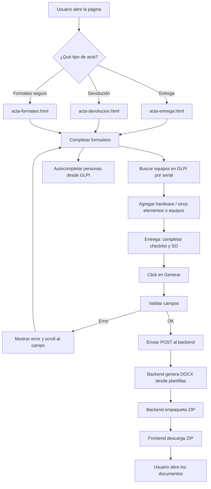

---

## 2. Acta de Entrega

Genera **dos documentos**: el acta de entrega y la lista de chequeo.

### 2.1 Captura de datos

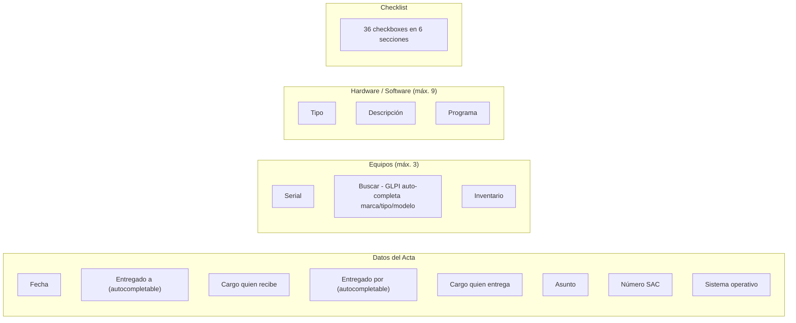

**Campos obligatorios del acta:** Fecha, Entregado a, Cargo quien recibe, Entregado por, Cargo quien entrega, Asunto, Número SAC, Sistema operativo.

**Campos obligatorios por equipo:** Serial, Inventario.

### 2.2 Checklist — Secciones

| Sección | Checkboxes | Ejemplos |
|---------|-----------|----------|
| Seguridad y Configuración | 1–10 | Antivirus, DLP, Cifrado, Firewall |
| Software Base | 11–18 | Office, Adobe Reader, Java, 7-Zip |
| Sistema Operativo | 19–24 | NetBIOS, Wake On LAN, OneDrive |
| Conectividad | 25–27 | VPN, RDP, Impresoras |
| Aplicaciones Corporativas | 28–32 | Directorio Activo, Cobis, Cisco |
| Áreas Específicas | 33–36 | Comercio Exterior, Tesorería |

### 2.3 Envío y respuesta

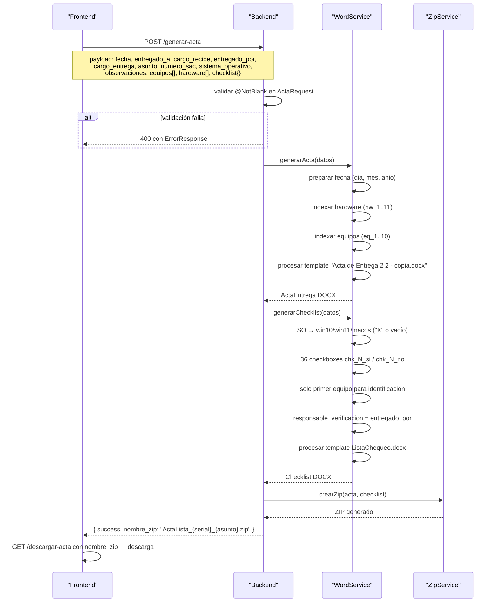

### 2.4 Documentos generados

| Documento | Contenido |
|-----------|-----------|
| `ActaEntrega_{serial}_{asunto}.docx` | Datos de entrega, equipos y hardware |
| `Checklist_{serial}_{asunto}.docx` | 36 verificaciones, SO y datos del primer equipo |

---

## 3. Acta de Devolución

Genera **un solo documento**: el acta de devolución.

### 3.1 Captura de datos

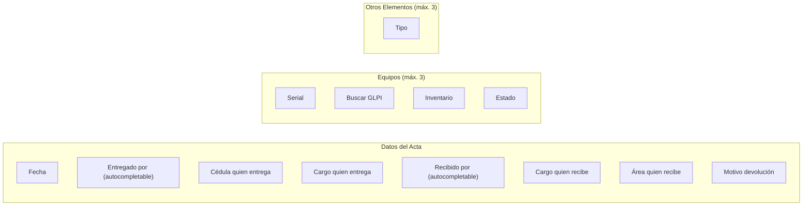

> **Nota:** el campo **Estado** existe únicamente en devolución. El bloque **Otros Elementos** solo solicita el tipo.

**Campos obligatorios:** Fecha, Nombre quien entrega, Cédula, Cargo quien entrega, Recibido por, Cargo quien recibe, Área quien recibe, Motivo.

**Campos obligatorios por equipo:** Serial, Inventario, **Estado**.

> **Diferencia clave con entrega:** la devolución NO incluye checklist ni sistema operativo. SÍ incluye el campo "Estado" por equipo y el bloque "Otros Elementos".

### 3.2 Envío y respuesta

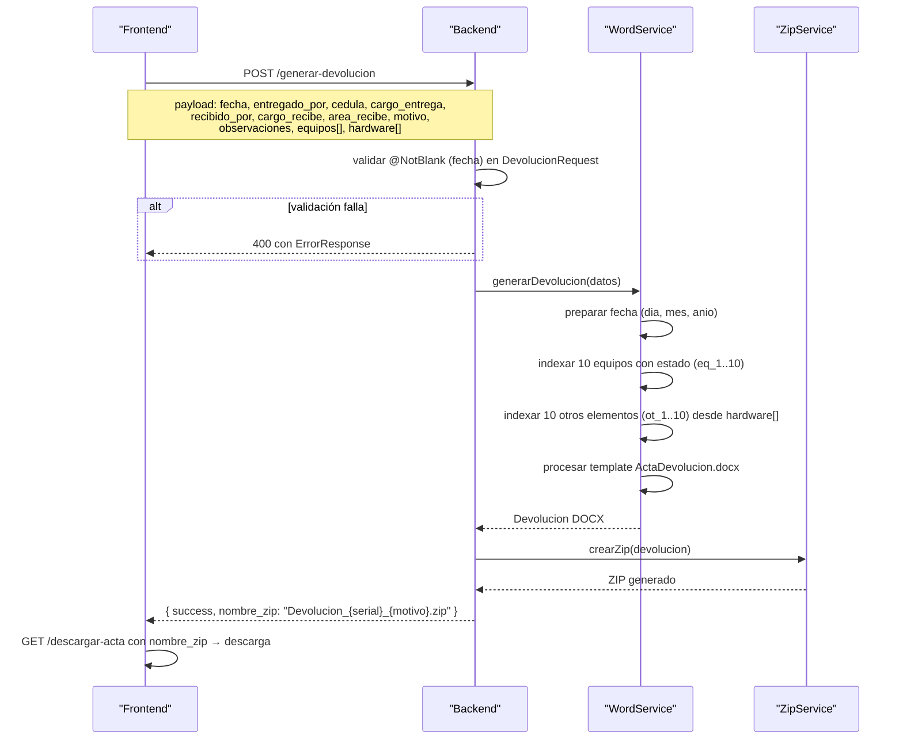

### 3.3 Documento generado

| Documento | Contenido |
|-----------|-----------|
| `Devolucion_{serial}_{motivo}.docx` | Datos de entrega/devolución, equipos con estado y otros elementos |

---

## 4. Acta de Formateo Seguro

Genera **un solo documento**: el acta de formateo seguro. Límite de **4 equipos** por capacidad de plantilla. Cada equipo incluye **cantidad en GB**.

### 4.1 Captura de datos

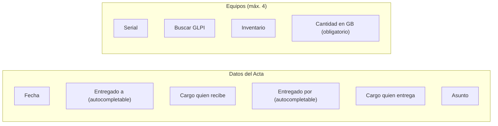

> **Diferencias con entrega/devolución:** no tiene checklist, ni sistema operativo, ni hardware/otros. Incluye el campo **GB** por equipo y un límite de **4 equipos** (capacidad de la plantilla DOCX).

**Campos obligatorios:** Fecha, Entregado a, Cargo quien recibe, Entregado por, Cargo quien entrega, Asunto.

**Campos obligatorios por equipo:** Serial, Inventario, **GB**.

### 4.2 Envío y respuesta

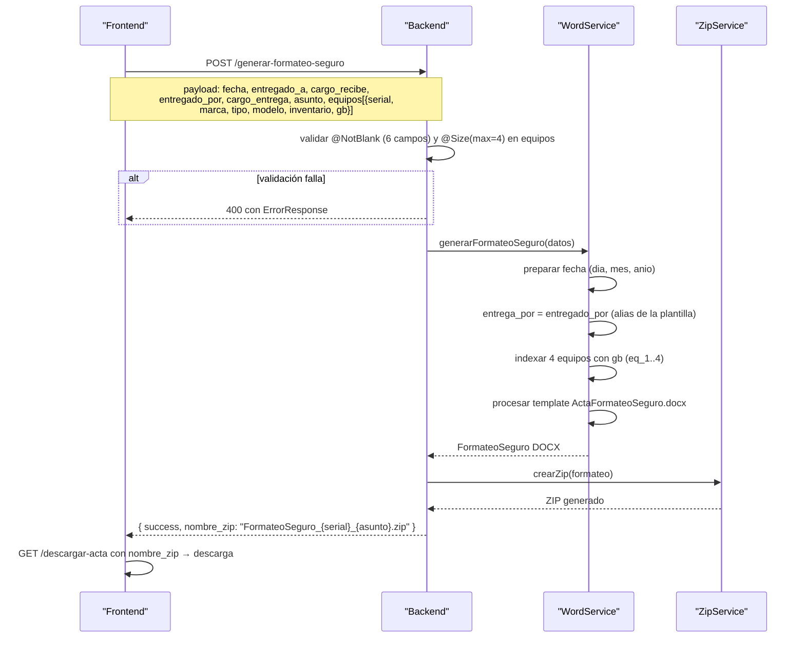

### 4.3 Documento generado

| Documento | Contenido |
|-----------|-----------|
| `FormateoSeguro_{serial}_{asunto}.docx` | Datos del acta, hasta 4 equipos con marca/tipo/modelo/serial/inventario/GB |

---

## 5. Búsqueda de equipo en GLPI

Cuando el usuario hace click en "Buscar" dentro de un bloque de equipo:

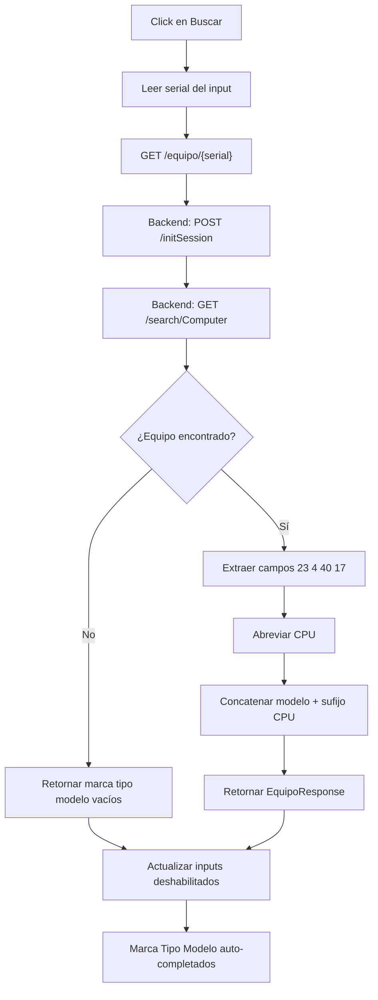

**Procesamiento del CPU:**

El nombre completo del procesador se abrevia para el acta (regex en `EquipoService.cpuCorto`):

| GLPI campo 17 | Acta |
|-----------------|------|
| Intel(R) Core(TM) i5-12400 | Core i5 |
| AMD Ryzen 5 5600X | Ryzen 5 |
| 12th Gen Intel(R) Core(TM) i7-12700K | Core i7 |
| Intel(R) Xeon E5-2620 | Xeon |

> **Nota:** si GLPI no responde o no encuentra el equipo, la respuesta es un `EquipoResponse` con `marca`, `tipo` y `modelo` vacíos. El backend nunca rompe el flujo por un error de GLPI (manejo silencioso, sin log).

---

## 6. Autocompletado de usuarios

Se activa al escribir **3 o más caracteres** en los campos de personas:

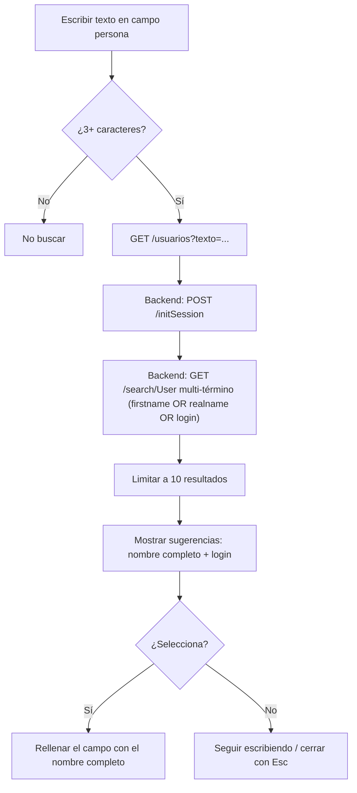

**Estrategia multi-término (back-end):**

- El texto se separa en términos por espacios.
- Cada término busca `contains` en firstname (`9`), realname (`34`) y login (`1`), encadenados con **OR** dentro del término.
- Los grupos de términos se encadenan con **AND**.

Así, **"Julian Celis"** encuentra un usuario con `firstname = "Julian Alejandro"` y `realname = "Celis Valderrama"` (GLPI `name = "JuliCeli"`), aunque las palabras no sean consecutivas ni estén en el mismo campo.

| Página | Campos |
|--------|--------|
| Acta de Entrega | Entregado a, Entregado por |
| Acta de Devolución | Entregado por, Recibido por |
| Acta de Formateo Seguro | Entregado a, Entregado por |

---

## 7. Generación de documentos Word

### 7.1 Motor de templates (`DocxTemplateEngine`)

Reemplaza placeholders `{{ var }}` en DOCX **a nivel de run**, preservando el formato:

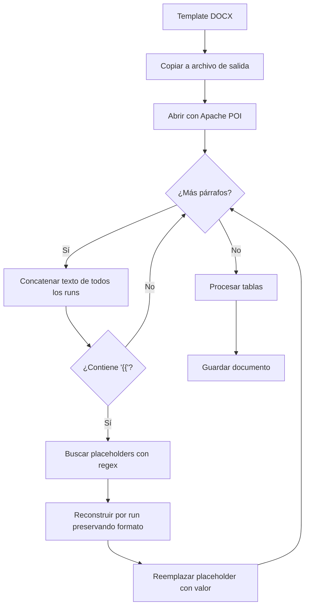

### 7.2 Por qué a nivel de run

Cuando Word aplica formato diferente (negrita, color, tamaño) a partes de un mismo texto, lo fragmenta en múltiples "runs":

```
Run 1: "Serial: "           formato normal
Run 2: "placeholder_serial" formato negrita
Run 3: " "                  formato normal
```

Este motor detecta en qué run inicia el placeholder y escribe el valor ahí, preservando la negrita del Run 2.

### 7.3 Preparación de datos

Antes de pasar los datos al motor, `DocumentoWordService` transforma la información:

**Fecha:**

```
fecha: 2026-08-27  →  dia: 27, mes: 08, anio: 2026
```

**Equipos indexados:**

```
equipos[0].marca = Dell      →  eq_1_marca = Dell
equipos[0].serial = ABC123   →  eq_1_serial = ABC123
equipos[1].marca = HP        →  eq_2_marca = HP
```

**Hardware indexado (acta de entrega):**

```
hardware[0].tipo = Monitor            →  hw_1_tipo = Monitor
hardware[0].descripcion = 24 pulgadas →  hw_1_descripcion = 24 pulgadas
```

**Otros elementos (acta de devolución):**

```
hardware[0].tipo = Teclado  →  ot_1_tipo = Teclado
```

**GB (acta de formateo seguro):**

```
equipos[0].gb = 512  →  eq_1_gb = 512
```

**Checkboxes marcados y desmarcados (carácter "X"):**

```
chk_1 = true   →  chk_1_si = "X", chk_1_no = ""
chk_2 = false  →  chk_2_si = "",  chk_2_no = "X"
```

**Sistema operativo:**

```
sistema_operativo = Windows 11
  →  win10 = "", win11 = "X", macos = ""
```

**Límites del template (backend, se rellenan con vacío los no enviados):**

| Prefijo | Máx. | Acta |
|---------|------|------|
| `eq_N_` | 10 | Entrega / Devolución |
| `eq_N_` | 4 | Formateo seguro |
| `hw_N_` | 11 | Entrega |
| `ot_N_` | 10 | Devolución |
| `chk_N_si` / `chk_N_no` | 36 | Checklist |

---

## 8. Empaquetado y descarga ZIP

### 8.1 Creación del ZIP

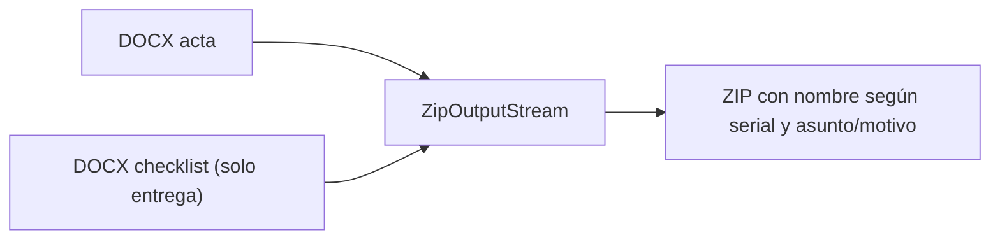

El nombre del ZIP se construye así:

- **Entrega:** `ActaLista` + serial del primer equipo + `_` + asunto sin caracteres especiales + `.zip`
- **Devolución:** `Devolucion` + serial del primer equipo + `_` + motivo sin caracteres especiales + `.zip`
- **Formateo seguro:** `FormateoSeguro` + serial del primer equipo + `_` + asunto sin caracteres especiales + `.zip`

Los caracteres especiales se eliminan con `replaceAll("[^a-zA-Z0-9]", "")`. Si no hay equipos, el serial es `SinSerial`.

### 8.2 Descarga

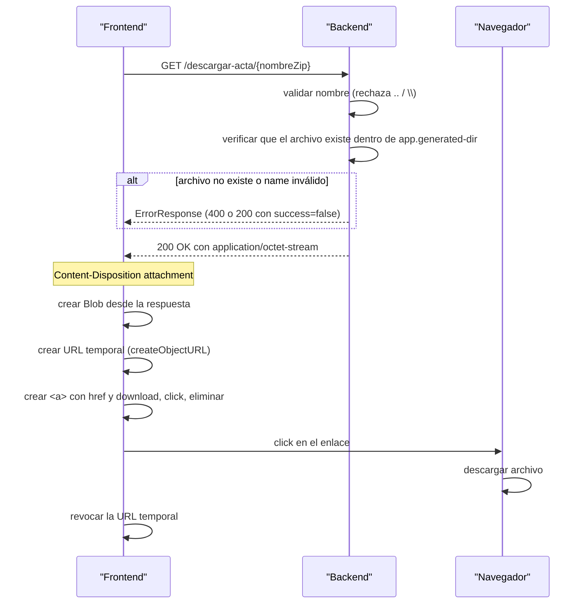

---

## 9. Validaciones

### 9.1 Acta de Entrega

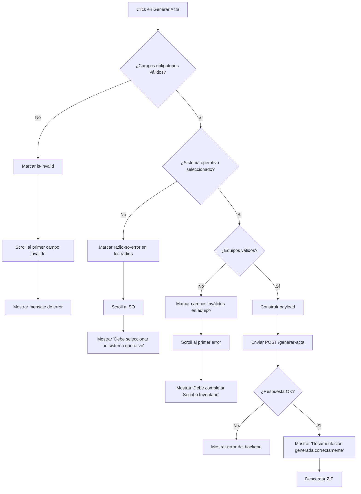

### 9.2 Acta de Devolución

Mismo flujo que entrega, con estas diferencias:

- **Campos obligatorios diferentes:** incluye cédula, área y motivo; no incluye entregado_a, asunto, numero_sac ni SO.
- **Sin validación de SO:** no hay sistema operativo.
- **Validación de equipo incluye Estado:** serial, inventario y estado son obligatorios.
- **Sin checklist:** se omite toda la sección de verificación.

### 9.3 Acta de Formateo Seguro

Mismo flujo base, con estas diferencias:

- **Campos obligatorios:** fecha, entregado_a, cargo_recibe, entregado_por, cargo_entrega, asunto (sin numero_sac, sin SO).
- **Validación de equipo incluye GB:** serial, inventario y cantidad en GB son obligatorios.
- **Límite de equipos: 4** (capacidad de la plantilla).
- **Sin checklist ni hardware/otros.**

### 9.4 Resumen de validaciones por campo

| Campo | Entrega | Devolución | Formateo seguro | Obligatorio |
|-------|---------|------------|-----------------|-------------|
| Fecha | Sí | Sí | Sí | Sí |
| Entregado a | Sí | No | Sí | Sí |
| Cargo quien recibe | Sí | Sí | Sí | Sí |
| Entregado por | Sí | Sí | Sí | Sí |
| Cargo quien entrega | Sí | Sí | Sí | Sí |
| Asunto | Sí | No (usa motivo) | Sí | Sí |
| Número SAC | Sí | No | No | Sí |
| Sistema operativo | Sí | No | No | Sí |
| Cédula | No | Sí | No | Sí |
| Área quien recibe | No | Sí | No | Sí |
| Motivo | No | Sí | No | Sí |
| Serial equipo | Sí | Sí | Sí | Sí |
| Inventario equipo | Sí | Sí | Sí | Sí |
| Estado equipo | No | Sí | No | Sí |
| GB por equipo | No | No | Sí | Sí |
| Máx. equipos | 3 | 3 | 4 | — |
| Máx. hardware/otros | 9 | 3 | — | — |
| Checklist | Sí (36) | No | No | — |